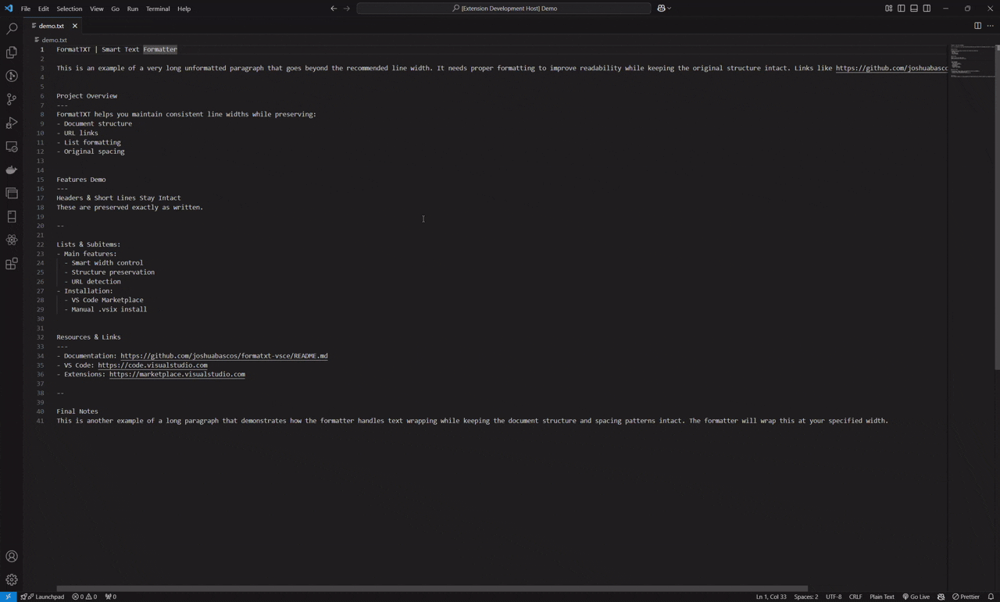

# FormatTXT

A powerful VS Code extension that formats text while intelligently preserving document structure and spacing patterns.

## Features

- **Smart Line Width Control**: Format text to any desired line width
- **Structure Preservation**: 
  - Maintains document sections (---)
  - Keeps block separators (--)
  - Preserves list formatting
- **Intelligent Formatting**:
  - Automatic URL detection and preservation
  - Header and short line retention
  - Original spacing pattern maintenance
  - Smart paragraph handling

## How to Use

### Format Entire File

1. Press `Ctrl + Shift + P` to open Command Palette
2. Type "FormatTXT" and select
3. Enter desired line width (default: 90)
4. Press `Enter` to format

> **Note:** Non-.txt files require confirmation

<!--  -->

## Document Structure

### Section Markers
Use `---` to separate major sections

### Block Separators 
Use `--` to separate blocks within sections

### Lists
- Starts with `-`
- Preserves indentation
- Maintains list structure

## Requirements
- VS Code 1.96.0 or higher

## License
MIT License - see LICENSE file for details